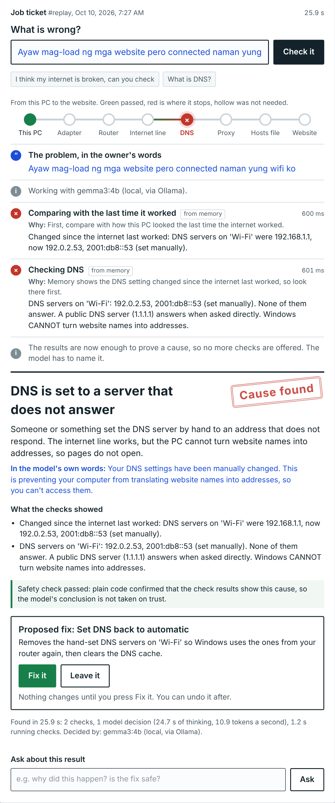

# Ayos

**A local AI technician for your PC. It finds out why your internet or computer is not working, shows you the proof, and fixes it with your approval. It runs on your own computer, so it works when the internet does not.**

"Ayos" is Filipino for *fixed* and for *all good*.

Built for the AppBuildersPH Hackathon 2026 (theme: Local AI).

**See it without installing anything:** [a replay of recorded sessions, in the real interface](https://shaocodes.github.io/Ayos/). Ayos itself is a Windows program that runs on your own PC, so the page plays back real recorded runs.



## The problem

When the internet stops working, the tools that could help are on the internet. A cloud AI assistant cannot answer, a search engine cannot be reached, and the family member who "knows computers" is not home. Most of the causes are small settings a technician fixes in a minute: a wrong DNS server, a proxy left on, an adapter switched off, a line in the hosts file.

A repair assistant has to be local, because the fault it repairs is the connection itself.

## What Ayos does

1. You say what is wrong in your own words, in English or Taglish.
2. **Memory first.** Ayos compares the PC with how it looked the last time the internet worked. If a setting changed, it checks that area at once.
3. **A language model running on your PC** reads the results. If more is needed, it chooses the next check from a fixed menu, reads the result, and chooses again. You watch its reasoning being written, word by word.
4. The model names a cause. **Plain code then checks that the results really show that cause.** If they do not, the conclusion is refused, with the reason, and the model has to look again. If proof is missing, the safety check runs the missing checks itself before it decides.
5. Ayos shows the cause, the evidence, and the exact change it wants to make.
6. Nothing changes until you press **Fix it**. After the fix, the checks run again to prove it worked. Every fix can be undone.
7. Ayos remembers what this PC looks like when it works, and what went wrong before.

```
  you ──"ayaw mag-load ng mga website"──┐
                                        ▼
        memory: what changed since the internet last worked?  ──▶  check that area
                                        │
                                        ▼
        local model (Ollama, on this PC): read the results
              not enough yet ──▶ pick ONE check from a fixed menu ──▶ read ──▶ repeat
              enough ──▶ name the cause, explain it in plain words
                                        │
                                        ▼
        safety check (plain code, not the model): do the results really show this cause?
              no ──▶ refused, with the reason         proof missing ──▶ run it, judge again
              yes
                                        ▼
        you approve ──▶ one named, reversible fix ──▶ checks run again ──▶ saved to memory
```

## What runs locally

Everything. The language model runs on this computer through [Ollama](https://ollama.com). The checks, the safety check, the fixes and the memory are Python on this computer. Your question, your settings and the diagnosis never leave it.

The only network traffic Ayos makes is the diagnosis itself: it tries to reach a Microsoft test page, public DNS servers and your router, because testing the connection is the job. No cloud AI or other online service is used at any point.

## Why the model cannot break your PC

- The model never writes commands. Each turn it returns one small JSON object that picks from a fixed menu of 15 read-only checks or names one of 18 known causes. The menu is enforced by the model server's structured output, and checked again in code.
- The menu changes with the evidence. An internet problem is only offered network checks and network causes. Once the results already prove a cause, no more checks are offered: the model has to name it.
- A cause is only accepted if the check results support it (`ayos/rules.py`, `supports()`). A model that guesses is refused and told why.
- Fix details (which adapter, which hosts line) come from the check results, never from the model's text.
- Only 12 fixes exist (`ayos/fixes.py`). Each one states exactly what it changes and needs your approval. The ones that change a setting can be undone, except asking the router for a new address, where there is nothing to undo.
- The web page talks to a server on `127.0.0.1` only, and every action needs a secret token created at start-up, so a website open in another tab cannot drive Ayos.
- If no model is running, or the model returns something unusable, built-in rules take over that step. The interface always shows who made each decision.

## Run it

You need Windows 10 or 11, Python 3.10 or newer, and Ollama.

1. Install [Ollama](https://ollama.com), then in a terminal: `ollama pull gemma3:4b`
2. Double-click **`start_ayos.bat`**. It asks for administrator rights (needed to change network settings) and opens Ayos in its own window. Nothing is sent anywhere: the window shows a page served by Ayos on this PC (`http://127.0.0.1:8020`). It uses Microsoft Edge, which is part of Windows, to draw the window; `--browser` opens a normal browser tab instead.
3. Type what is wrong, or use the **Practice bench** on the right to break one setting on purpose, then ask Ayos to find it.

Other ways to start:

| File | What it does |
|---|---|
| `start_ayos.bat` | The real thing, on this PC. |
| `start_ayos_simulated.bat` | A pretend PC for rehearsing. Changes nothing on this computer. No administrator rights needed. |
| `selftest.bat` | Runs every read-only check once and times the model. Changes nothing. |
| `restore_network.bat` | Emergency reset. Undoes the practice faults without Python or Ayos. |

Options: `python -m ayos --model gemma3:1b` picks a model. `python -m ayos --api openai --url http://127.0.0.1:1234` uses LM Studio or any OpenAI-compatible local server.

No Python packages need to be installed. Ayos uses only the Python standard library.

**No Python on the PC?** Download `Ayos.exe` from the [Releases page](https://github.com/shaocodes/Ayos/releases). It is built from this repository by GitHub Actions. Windows may show a SmartScreen warning because the file is not signed: choose *More info*, then *Run anyway*.

## What it can diagnose

| | Cause | What Ayos does |
|---|---|---|
| Internet | Network adapter turned off | Turns it back on |
| Internet | Wi-Fi not joined to any network | Opens Wi-Fi settings |
| Internet | Router gave the PC no address | Asks the router again |
| Internet | Router not answering | Says so; restart the router |
| Internet | Wi-Fi needs a sign-in page first (mall, hotel, school) | Opens the sign-in page |
| Internet | Provider outage | Says so; nothing on the PC needs fixing |
| Internet | DNS set by hand to a dead server | Sets DNS back to automatic, or to what worked before |
| Internet | Router's DNS not answering | Switches to a public DNS server |
| Internet | Proxy setting blocking the browser | Turns the proxy off |
| Internet | Hosts file blocking a website | Removes that line only |
| Internet | Date and time wrong (secure sites warn) | Sets the clock right |
| Internet | Nothing wrong | Proves it: every check passes |
| Slow PC | Drive almost full | Opens Storage settings |
| Slow PC | Memory almost full | Names the apps using it |
| Slow PC | Too many start-up apps | Opens Startup apps settings |
| Slow PC | Battery saver slowing the laptop | Opens battery settings |
| Slow PC | Not restarted for a week, or an update waiting | Says to restart, not shut down |
| Slow PC | Nothing wrong | Says so, with what it checked |

It also answers general computer questions ("what is DNS?") with the local model. Adding a cause means adding one check, one rule in `ayos/rules.py` and, if there is a safe one, a fix. The safety check and the interface pick it up without changes.

## The practice bench

Real faults are hard to produce on demand, so Ayos can create five safe ones on the real PC. Each is a single setting, and each is undone by **Put everything back** or by `restore_network.bat`.

| Fault | What you would notice | What Ayos should find | The fix |
|---|---|---|---|
| Wrong DNS server | Wi-Fi shows connected, no website opens | DNS set by hand to a server that does not answer | Set DNS back to automatic |
| Adapter turned off | No connection at all | The network adapter is turned off | Turn it back on |
| Fake proxy | The browser reaches nothing | A proxy is on, pages load without it | Turn the proxy off |
| Block example.com | Only that one site fails | A hosts-file line blocks the site | Remove that line |
| Wrong date and time | Secure websites say "Your connection is not private" | The PC's clock is wrong | Set the clock from the internet's time |

The simulated PC adds eleven more that cannot be staged safely on a real machine, such as a dead router, a provider outage, a Wi-Fi sign-in page, a full drive and a PC that has not been restarted for weeks.

## Measured results

<!-- RESULTS -->
Measured by GitHub Actions on a 4-thread cloud CPU with no graphics card (x86_64, Linux 6.17.0-1022-azure, measured 2026-10-09). 24 cases on the simulated PC: 16 faults, 2 healthy PCs, and 6 of the same problems said the way people say them, including Taglish. Simulated checks answer instantly, so the times are almost all model time. Speed on another computer will differ; accuracy should be close. The cloud machines are not all equally fast, so read each time next to that row's tokens per second.

- **Model alone**: the first cause the model named was the right one.
- **With safety check**: the final diagnosis was right, after plain code checked the model.
- **With memory**: Ayos has seen this PC healthy before and can compare. This is the normal case.

The first three columns after the model name describe the model; the next three are with memory, the last three without.

| Model | Size | Tokens/s | Model alone | With safety check | Median time | Model alone | With safety check | Median time |
|---|---|---|---|---|---|---|---|---|
| `gemma3:1b` | 0.8 GB | 40.4 | 11/24 | 24/24 | 4.4 s | 14/24 | 24/24 | 8.7 s |
| `qwen2.5:3b` | 1.9 GB | 13.4 | 17/24 | 24/24 | 10.9 s | 18/24 | 24/24 | 20.4 s |
| `llama3.2:3b` | 2.0 GB | 10.9 | 17/24 | 24/24 | 15.4 s | 18/24 | 24/24 | 40.0 s |
| `gemma3:4b` | 3.3 GB | 9.6 | 19/24 | 24/24 | 38.6 s | 19/24 | 24/24 | 61.9 s |

In the recorded replay, made on the same kind of machine, the four practice-bench faults took 21.1 to 25.9 seconds each with `gemma3:4b` running at 9.6 tokens a second, from the question to a verified cause.

### What the first measurement taught us

The first time we measured, the small models reasoned correctly and then kept asking for more checks. They almost never named a cause, so the built-in rules had to finish the job:

| Model | Size | Tokens/s | Model alone | With safety check | Median time | Model alone | With safety check | Median time |
|---|---|---|---|---|---|---|---|---|
| `gemma3:1b` | 0.8 GB | 16.5 | 0/20 | 18/20 | 38.0 s | 0/20 | 18/20 | 49.0 s |
| `llama3.2:3b` | 2.0 GB | 16.2 | 1/20 | 20/20 | 37.1 s | 4/20 | 20/20 | 39.0 s |
| `qwen2.5:3b` | 1.9 GB | 11.2 | 7/20 | 19/20 | 44.6 s | 4/20 | 20/20 | 62.8 s |

So we changed the design, not the model. Once the check results already prove a cause, no more checks are offered and the model has to name it. An internet problem is only offered network checks. When memory shows a setting changed, Ayos looks there first. A refused conclusion comes back with the reason. The table at the top is the same models after those changes. The raw result files for both runs are in `docs/results/`, next to the output of the live test on real Windows.
<!-- /RESULTS -->

On a team member's home PC with a mid-range graphics card (AMD RX 6600, 16 GB RAM), the built-in self-test (`selftest.bat`) measured `gemma3:4b` at about 40 tokens a second, with the first decision in 3.6 seconds. That is one PC measured once, not a benchmark.

To measure a model on your own computer:

```
python -m ayos.evalsim                    best installed model
python -m ayos.evalsim --model gemma3:1b  a specific model
python -m ayos.evalsim --no-memory        without the "what changed" memory
python -m ayos.evalsim --rules            built-in rules only, for comparison
```

It reports two scores. **Model alone** is how often the model's own first conclusion was the right cause. **With safety check** is how often the final diagnosis was right. The gap between the two is what the safety check is for.

## How it is tested

- `python -m unittest discover -s tests` runs 95 tests on any computer: every fault on the simulated PC, the safety check against wrong model conclusions, approval and undo, memory, the model client against a stand-in model server, the web server's token and host checks, and the Windows layer against a stand-in PowerShell.
- `tests/windows_live_test.py` runs on real Windows as administrator. It breaks the DNS setting, the proxy and the hosts file for real, lets Ayos find and fix each one, and checks the internet is back. It also switches a network adapter off and on, runs the emergency reset script, and starts Ayos through `start_ayos.bat`.
- `tests/ui_test.py` drives the whole interface in a browser.
- GitHub Actions runs all of that on a real Windows machine (`.github/workflows/windows.yml`), runs the unit tests on Python 3.8 to 3.13, builds `Ayos.exe`, and measures real models on a CPU-only machine (`model-eval.yml`).
- Not covered by automation: the complete "adapter turned off" repair on the PC's only adapter (it would cut the test machine off from its own controller). The switch-off and switch-on commands are tested on a spare adapter, and the complete repair on the simulated PC.

- Before the deadline a second reviewer read the code cold, without having seen it written, and wrote failing cases for what it found: a job replayed in the page, a switched-off adapter missed next to a VPN adapter, old hosts-file lines blamed for an unrelated fault. Each one was fixed and has a test (`FoundInReview` in `tests/test_agent.py`).

Three things the real Windows machine taught us that the simulated PC could not:

- Starting PowerShell for every check cost one to three seconds each time. Ayos now keeps one PowerShell open, and a diagnosis that took 15 seconds takes 3.
- Its router ignores pings, like many public Wi-Fi networks. Ayos used to call that a dead router. Now traffic passing through the router counts as proof that it works.
- It had two adapters switched on and only one with an address. Ayos now picks the adapter that has the router.

## What is in the box

| Path | What it is |
|---|---|
| `ayos/brain.py` | The model client (Ollama or OpenAI-compatible), the prompt, the JSON menu, and the rule-based fallback. |
| `ayos/agent.py` | One repair session: recall, investigate, conclude, safety check, approval, fix, verify, remember. |
| `ayos/tools.py` | The 15 read-only checks. Each returns a plain-words summary for the model and structured data for the safety check. |
| `ayos/rules.py` | The 18 causes, and the code that decides whether evidence supports a cause. |
| `ayos/fixes.py` | The 12 fixes, the 5 practice faults, and "put everything back". |
| `ayos/memory.py` | What normal looks like on this PC, and the history of past problems. A JSON file in `data/`. |
| `ayos/system.py` | Everything that touches the computer: the real Windows layer and the simulated PC. |
| `ayos/server.py`, `web/index.html` | The local web server and the interface. |
| `ayos/evalsim.py` | Measures a model on simulated faults. |
| `tools/build_live_demo.py` | Records sessions and builds the replay page in `docs/`. |
| `docs/DEMO.md` | The five-minute demo, the checklist, and what to do if something breaks. |

## Limits, stated plainly

- Windows only. The agent logic runs anywhere on the simulated PC, but the real checks and fixes use Windows commands.
- It diagnoses the 18 causes in `ayos/rules.py`. For anything else it says it could not find a single cause and lists what it checked. It does not guess.
- It cannot fix a dead router or a provider outage. It tells you that is what it is, so you stop changing settings on a PC that is fine.
- Model speed depends on the computer. On a laptop with no graphics card a small model takes several seconds per decision.
- "Learning" here means memory: a saved picture of healthy settings and a history of past problems on this PC. No model is trained or fine-tuned. Memory can be switched off in the interface.
- The models understand a problem described in Taglish. The small ones usually reply in English.
- Proving that nothing is wrong takes the longest, because every check has to pass first.
- If your browser's secure DNS is set to a specific provider, the browser may keep working when Windows DNS is broken. Ayos checks the Windows setting.

## Disclosures

**Models.** Any open chat model that Ollama can run. Developed and measured with Google's Gemma 3 (`gemma3:4b`, `gemma3:1b`), Meta's Llama 3.2 (`llama3.2:3b`) and Alibaba's Qwen 2.5 (`qwen2.5:3b`). The models are used as published, each under its own licence. No model was trained or fine-tuned for this project. The default is `gemma3:4b`.

**Frameworks and tools.** Python standard library only for Ayos itself. Ollama serves the model. Windows PowerShell networking cmdlets are used for checks and fixes. Playwright is used in one optional interface test and for the screenshots. PyInstaller builds `Ayos.exe`. GitHub Actions runs the tests, the measurements and the build.

**External APIs.** None. No cloud AI, no online service.

**AI coding tools.** Code in this repository was written with Claude (Anthropic) as an AI coding assistant, directed and tested by the team. Commits carry a `Co-Authored-By: Claude` line.

**Existing code.** None. Everything in this repository was written during the hackathon.

**What we built on top of the open model.** The model is one part. The agent loop, the fixed menu of checks, the safety check that verifies the model's conclusion, the reversible fixes, the memory, the Windows layer, the simulated PC, the evaluation tool and the interface were all built during the hackathon.

## Team

<!-- TEAM -->
Add team member names here.
<!-- /TEAM -->
